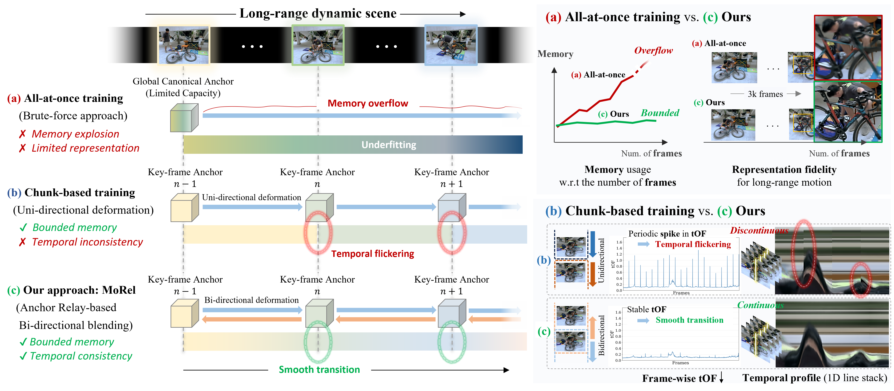

<h1>
  [arXiv'25]  
  MoRel: Long-Range Flicker-Free 4D Motion Modeling via Anchor Relay-based Bidirectional Blending with Hierarchical Densification
</h1>

**<a href="mailto:s.kwak@etri.re.kr">Sangwoon Kwak</a>**1*, 
**<a href="mailto:weeyoungkwon@cau.ac.kr">Weeyoung Kwon</a>**2*, 
**<a href="mailto:jyj0120@etri.re.kr">Jun Young Jeong</a>**1, 
**<a href="mailto:joelkimgh@cau.ac.kr">Geonho Kim</a>**2,  
**<a href="mailto:wscheong@etri.re.kr">Won-Sik Cheong</a>**1, 
**<a href="mailto:jihyongoh@cau.ac.kr">Jihyong Oh</a>**2†  
 

1Electronics and Telecommunications Research Institute (ETRI)  
2Chung-Ang University  
 
*Equal contribution, †Corresponding author

 
 
1Chung-Ang University, 2Collaborating institutions

<!-- * Official project page:  https://cmlab-korea.github.io/MoRel/
* Paper (arXiv):  -
* Code will be updated soon -->

This repository is the official PyTorch implementation of  
**“MoRel: Long-Range Flicker-Free 4D Motion Modeling via Anchor Relay-based Bidirectional Blending with Hierarchical Densification.”**

  
Figure 1. MoRel enables long-range, flicker-free 4D reconstruction with temporally coherent details, even under large motions and topology changes.

## News
* Repository created and initial codebase is being organized.
* Paper under review; details will be updated after the review process.

## Code Release Plan
- [ ] Core MoRel training and rendering pipeline
- [ ] Anchor Relay-based Bidirectional Blending (ARBB) modules
- [ ] Hierarchical Densification utilities and analysis tools
- [ ] Dataset preparation and evaluation scripts

## Abstract

Recent advances in 4D Gaussian Splatting (4DGS) have extended the high-speed rendering capability of 3D Gaussian Splatting (3DGS) into the temporal domain, enabling real-time rendering of dynamic scenes. However, one of the major remaining challenges lies in modeling long-range motion-contained dynamic videos, where a naïve extension of existing methods leads to severe memory explosion, temporal flickering, and failure to handle appearing or disappearing occlusions over time.

To address these challenges, we propose a novel 4DGS framework characterized by an **Anchor Relay-based Bidirectional Blending (ARBB)** mechanism, named **MoRel**, which enables temporally consistent and memory-efficient modeling of long-range dynamic scenes. Our method progressively constructs locally canonical anchor spaces at key-frame time indices and models inter-frame deformations at the anchor level, enhancing temporal coherence.

By learning bidirectional deformations between key-frame anchors (KfA) and adaptively blending them through learnable opacity control, our approach mitigates temporal discontinuities and flickering artifacts. We further introduce a **Feature-variance-guided Hierarchical Densification (FHD)** scheme that effectively densifies KfAs while preserving rendering efficiency, based on an assigned level of feature variance.

To effectively evaluate our model's capability to handle real-world long-range 4D motion, we newly compose a long-range 4D motion-contained dataset, called **SelfCapLR**. It exhibits larger average dynamic motion magnitude and is captured in spatially wider environments compared to previous dynamic video datasets.

Overall, **MoRel** achieves temporally coherent and flicker-free long-range 4D reconstruction while maintaining bounded memory usage, demonstrating both scalability and efficiency in dynamic Gaussian-based representations.

## Method Overview
MoRel: An anchor-based 4D motion modeling framework for long-range, flicker-free 4D Gaussian Splatting.

1. **Anchor Relay-based Bidirectional Blending (ARBB)**  
   MoRel maintains a sparse set of canonical anchors and propagates them bidirectionally along the temporal axis. Forward and backward anchor predictions are blended through a relay mechanism, which stabilizes motion trajectories, suppresses flicker, and resolves temporal ambiguities in occluded or fast-moving regions.

2. **Hierarchical Densification**  
   MoRel performs frequency- and error-aware densification over time. Starting from a compact anchor set, the framework selectively spawns new Gaussians in regions with high residuals or complex motion, enabling fine-grained detail reconstruction without excessive growth of primitives.

3. **Long-Range 4D Reconstruction**  
   By combining ARBB and hierarchical densification, MoRel reconstructs long sequences with consistent geometry and appearance. The model is compatible with standard 4DGS training objectives (e.g., photometric and perceptual losses) and can be seamlessly integrated into existing Gaussian Splatting pipelines.

## Prepare Dataset
TBD;  
We will provide:
- Dataset structure and naming conventions
- Scripts for converting multi-view videos and COLMAP outputs into the MoRel 4DGS format
- Example configurations for public dynamic scene benchmarks

## Environment Setting
TBD;  
The repository will include:
- Conda environment specification
- Required PyTorch and CUDA versions
- Installation instructions for the Gaussian rasterizer and related dependencies

## Get Started
TBD;  
We will provide:
- Minimal training example on a small dynamic sequence
- Inference script for rendering long-range 4D videos
- Configuration templates for different datasets and ablation studies

## Results
Please visit our [project page](https://cmlab-korea.github.io/MoRel/) for video demos, qualitative comparisons, and quantitative results.
